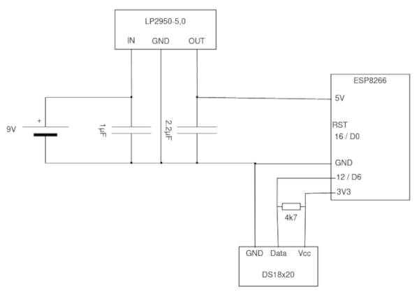

# espTemp
espTemp is a small battery powered temperature sensor which is able to send the measured temperatures to [tempSrvr](https://github.com/marcelb98/tempSrvr).

## Hardware
The software is running on an ESP8266.
To use 9V blocks as a power supply, a LP2950 is converting the voltage to 5V for the ESP-Board.
Temperatures are measured with DS18x20 sensors.

## Software
The software is based on microPython. Just copy the 4 python scripts from `src` to your ESP.
Configuration is done in `esptempconfig.py`.

After each cold start (not from deepsleep) the ESP will wait for 30 seconds.
This should be enough time to connect to the WebREPL and upload new files to the ESP.

GPIO2 is used for an LED which is blinking at each start and after the 30 seconds waittime.
To enable the LED the port is set to down (to make it work with some popular ESP boards).